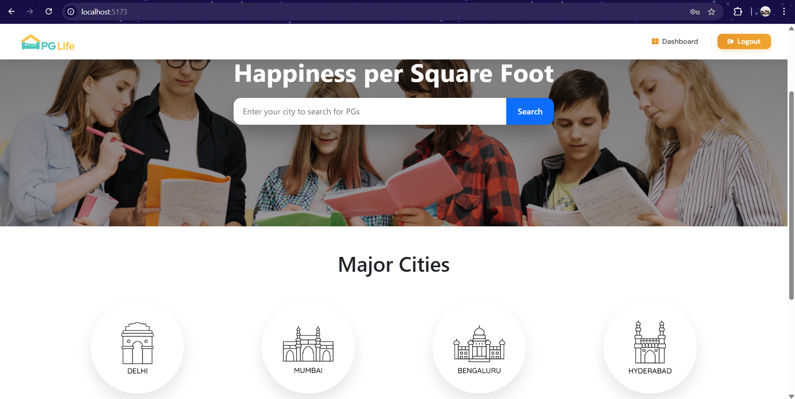
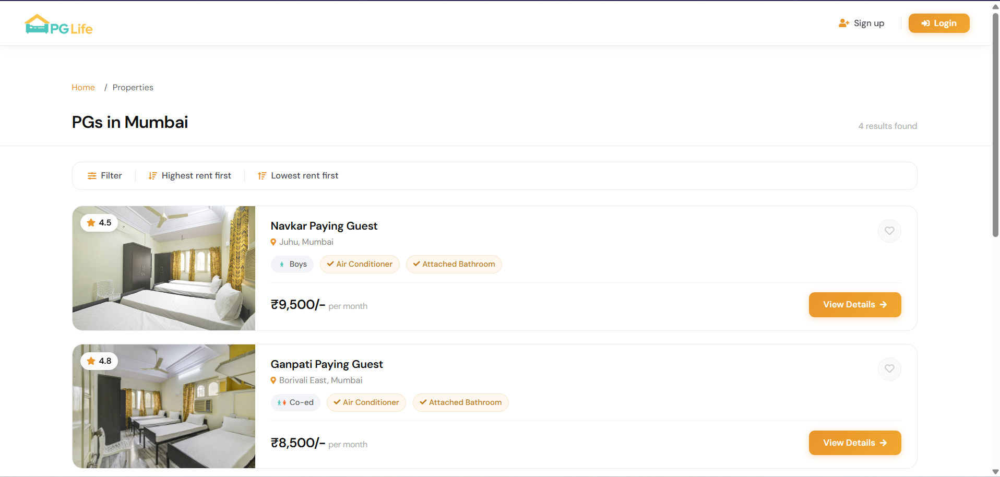
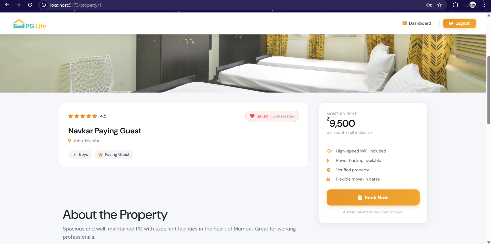
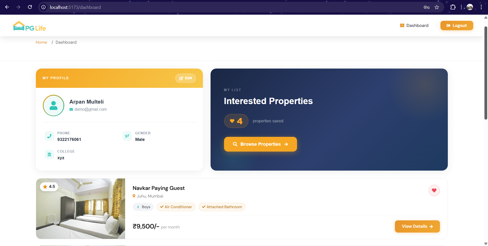
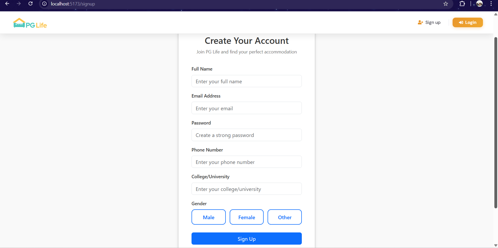
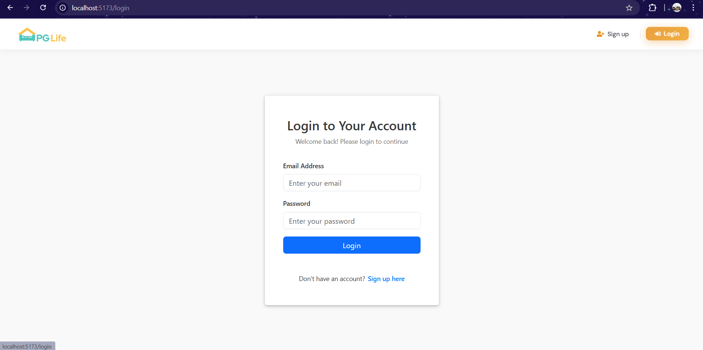
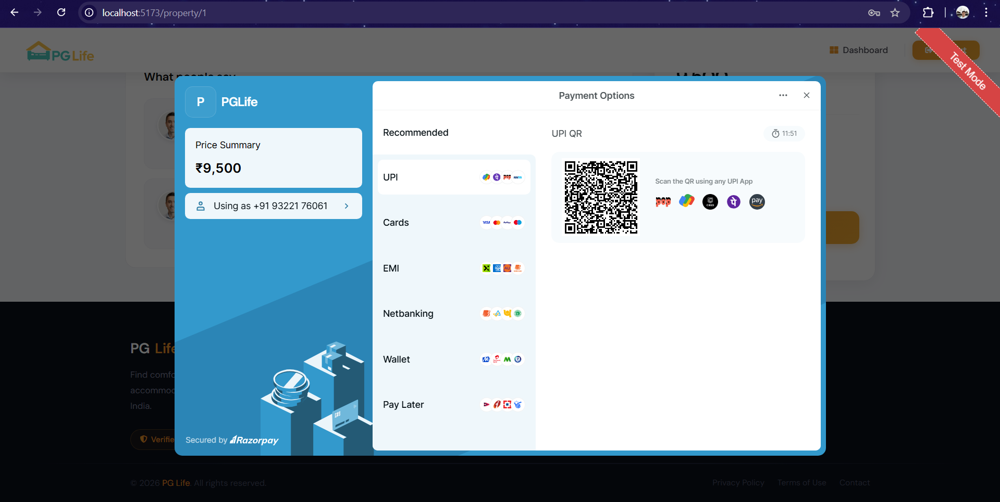

# 🏠 PGLife – PG Rental Platform

A full-stack web application that helps users discover and explore Paying Guest (PG) accommodations in different cities, view property details, save favorite properties, and complete payments using Razorpay (Test Mode).

## Description

This project is a full-stack PG rental web application that allows users to search and explore Paying Guest accommodations across different cities. Users can browse available PG properties, view detailed property information including amenities and pricing, mark properties as interested or favorite, and complete payments using Razorpay’s test mode.

The application consists of a modern React frontend and a Spring Boot REST API backend connected to a MySQL database. It demonstrates the implementation of a real-world rental platform workflow including user authentication, property discovery, user dashboards, and payment gateway integration.

This project highlights the integration of modern web technologies such as REST APIs, JWT authentication, relational database management, and third-party payment gateway integration to simulate a real-world PG booking platform.

---

## Architecture Diagram 🏗️

This diagram illustrates the system architecture used for this project:


---

## Project Demo 🎬

**Note:** The live deployed backend for this project is currently not available. The complete application flow, including property browsing, user authentication, dashboard interactions, and Razorpay test payment, is demonstrated below.


---

## 📸 Screenshots

### Home Page



### Property Listing



### Property Details



### User Dashboard



### Signup Page



### Login Page



### Payment Success



---

## Features ✨

### Frontend (React Application)

* Modern and responsive user interface built with **React and Vite**.
* Home page displaying available **cities and featured PG properties**.
* **Property Listing Page** to browse PG accommodations in a selected city.
* **Property Detail Page** showing property information such as amenities, pricing, and description.
* **User Authentication Pages** for login and signup.
* **User Dashboard** where users can view their profile and interested/favorite properties.
* Interactive UI components such as property cards, image carousels, and navigation breadcrumbs.
* Responsive design for better usability across different screen sizes.

### Backend (Spring Boot REST API)

* Backend built using **Spring Boot** with REST API architecture.
* **JWT-based authentication system** for secure login and protected routes.
* API endpoints for:

  * User registration and login
  * Fetching cities and property listings
  * Retrieving property details
  * Managing interested/favorite properties
* Secure communication between frontend and backend using **REST APIs**.
* Backend service integrated with **MySQL database** using JPA/Hibernate.

### Database (MySQL)

* Relational database used to store:

  * User information
  * Cities
  * Properties
  * Amenities
  * Interested/Favorite properties
* Database schema provided through SQL scripts for easy setup.

### Payment Integration (Razorpay)

* Integration with **Razorpay Checkout** in Test Mode.
* Simulates real payment flow without actual transactions.
* Secure payment initiation from the application.
* Payment success page after transaction completion.

---

## Technologies Used 💻

* **Frontend:** React.js, Vite, JavaScript, HTML5, CSS3
* **Backend:** Spring Boot, Java, REST APIs
* **Database:** MySQL
* **Authentication:** JSON Web Tokens (JWT)
* **Payment Gateway:** Razorpay (Test Mode)
* **Build Tools:** Maven, npm
* **Version Control:** Git & GitHub
* **Development Tools:** VS Code, Postman

---

## ⚙️ Setup Instructions

### 1️⃣ Clone Repository

```
git clone https://github.com/Arpan-Multeli/pglife-app.git
```

---

### 2️⃣ Database Setup

Import the SQL files:

```
database/pglife_db.sql
database/sample_data.sql
```

---

### 3️⃣ Backend Setup

Configure environment values in `application.properties`

```
spring.datasource.username=YOUR_DB_USERNAME
spring.datasource.password=YOUR_DB_PASSWORD

razorpay.key_id=YOUR_RAZORPAY_KEY
razorpay.key_secret=YOUR_RAZORPAY_SECRET
```

Run backend:

```
mvn spring-boot:run
```

---

### 4️⃣ Frontend Setup

```
cd pglife-frontend
npm install
npm run dev
```

---

## Future Enhancements 🚀

* **Admin Panel:** Build an admin dashboard to allow administrators to add, update, or remove PG properties, amenities, and cities dynamically.

* **Property Reviews & Ratings:** Allow users to leave reviews and ratings for PG properties to help future users make better decisions.

* **Map Integration:** Integrate Google Maps to show the exact location of PG properties.

* **Booking Management:** Allow users to track their bookings and payment history through the dashboard.

* **Notifications:** Add email or SMS notifications for booking confirmations and payment updates.

* **Cloud Deployment:** Deploy the application using modern cloud platforms (e.g., Vercel for frontend, Render or AWS for backend, and a cloud-hosted database).

* **Performance Optimization:** Implement caching and API optimization to improve application performance.

---

## 👨‍💻 Author

**Arpan Multeli**

GitHub:
https://github.com/Arpan-Multeli
